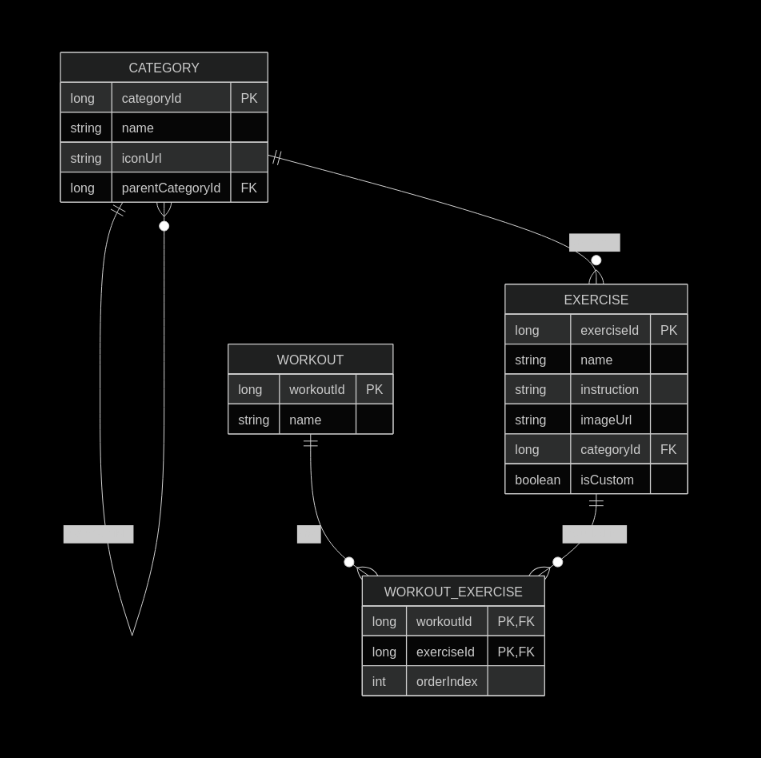

# Exercise Organizer

An offline-first Android application for browsing exercises, creating custom workouts, and managing personal exercise collections.

The app synchronizes exercise data from a REST API, stores it locally using Room, and remains fully usable without an internet connection after the initial synchronization.

Built with **Kotlin, Jetpack Compose, Room, Retrofit, Hilt, and Coroutines**.

---

## Features

* First-launch onboarding experience
* Browse sports and exercise categories
* Hierarchical category navigation
* Search sports by name
* View exercise instructions and images
* Create custom workouts
* Create custom exercises with personal name, images and instructions 
* Reorder exercises inside workouts
* Offline-first architecture
* Automatic synchronization with the backend API
* Store downloaded and custom images locally

---

## Screenshots

*Screenshots coming soon.*

---

# Tech Stack

| Technology           | Purpose                 |
| -------------------- | ----------------------- |
| Kotlin               | Programming language    |
| Jetpack Compose      | UI toolkit              |
| Material 3           | UI components           |
| Navigation Compose   | Navigation              |
| ViewModel            | UI state management     |
| Kotlin Coroutines    | Asynchronous operations |
| StateFlow & Flow     | Reactive UI             |
| Room                 | Local database          |
| Retrofit             | REST API client         |
| Kotlin Serialization | JSON parsing            |
| Hilt                 | Dependency Injection    |

---

# Architecture

The project follows the MVVM architecture.

```
                         USER
                           │
                           ▼
                  ┌────────────────┐
                  │ Compose Screens │
                  └────────────────┘
                           │
                           ▼
                  ┌────────────────┐
                  │   ViewModel    │
                  │ UI State/Logic │
                  └────────────────┘
                           │
                           ▼
                  ┌────────────────┐
                  │  Repository    │
                  │ Data Coordinator│
                  └────────────────┘
                       │        ▲
          Read data    │        │ Synchronization
                       │        │
                       ▼        │
              ┌────────────────┐
              │ Room Database  │
              │ Local Storage  │
              └────────────────┘
                       ▲
                       │
                       │
              ┌────────────────┐
              │ Retrofit API   │
              └────────────────┘
                       │
                       ▼
              ┌────────────────┐
              │ Spring Boot API│
              └────────────────┘
                       │
                       ▼
              ┌────────────────┐
              │ PostgreSQL DB  │
              └────────────────┘
```

### UI

The user interface is implemented entirely with **Jetpack Compose** and **Navigation Compose**.

Each screen observes reactive `StateFlow` data exposed by the ViewModel and automatically updates

---

### ViewModel Layer

The `OrganizerViewModel` coordinates application state by:

* synchronizing remote data
* exposing reactive UI state
* handling search
* managing selected categories and workouts
* executing CRUD operations
* handling synchronization errors

---

### Repository Layer

Repositories abstract data sources from the ViewModel.

Responsibilities include:

* fetching data from the REST API
* storing data in Room
* exposing reactive database queries
* downloading exercise images
* managing local files

---

### Local Database (Room)

Room acts as the **single source of truth** for application data.

The database contains:
- Categories with recursive parent-child hierarchy
- Exercises linked to categories
- User-created workouts
- Many-to-many workout/exercise relationships with ordering support 



---

### Image Storage

Exercise images are downloaded from the backend and stored inside the application's private storage.

Custom exercise images are imported from the device gallery and stored locally.

This allows the application to display images even when offline.

---

# Backend

This application consumes data from the companion **Exercise Organizer API** built with Spring Boot.

The backend provides:

* sports
* categories
* exercises
* sport icons
* exercise images

The API project is available in this repository as a separate module.
https://github.com/radomirklimov/ExerciseApi

---
